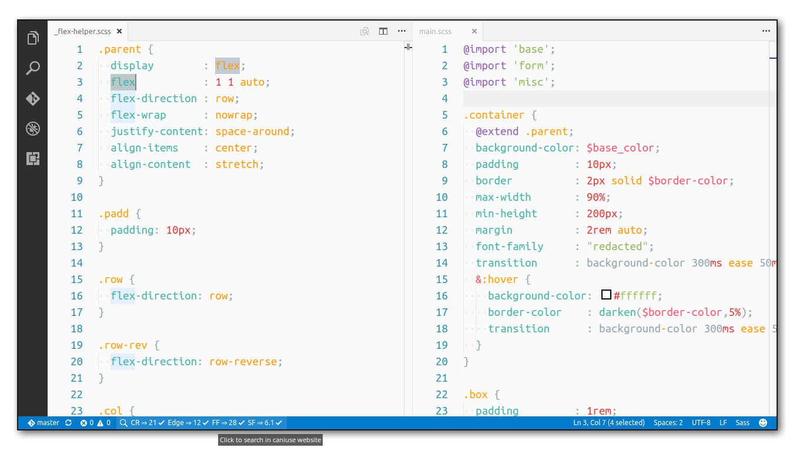

# vscode-caniuse (UNMAINTAINED)

### Instant & Offline check for HTML5, CSS3, SVG, JS API compatibility through [Can I Use](http://caniuse.com/).

> "Can I use" provides up-to-date browser support tables for support of front-end web technologies on desktop and mobile web browsers.



---------------
## Installation

You can install it via extension sidebar, search for `vscode-caniuse`. Or you can launch VS Code Quick Open (Ctrl+P), paste the following command, and press enter.

```
ext install vscode-caniuse
```

## Features

 - Highlight any text and either execute `Can I Use` or use default keybinding `alt + i` to display compatibility in status bar.
 - Provide user defined browser scope to perform search on either by executing `Browser scope` which sets for current session, or through extension config `caniuse.browser_scope`. A default keybinding `alt + b` is also available.
 - Toggle visiblity of major browsers vs all browsers through extension config `caniuse.show_all`.

## Extension Settings

This extension contributes the following settings:

* `caniuse.show_all`: show all available browsers(`true`) or only major ones(`false`).
* `caniuse.browser_scope`: set the browser scope - [Browserl.ist](http://browserl.ist/) ie. "`> 1%, last 2 versions, Firefox ESR`".

## TODO

- [ ] Tests
